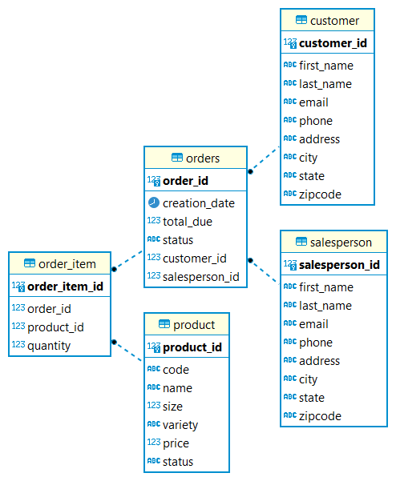

# Introduction
I have developed a Java application that uses JDBC API to perform CRUD operations on a PostgreSQL database. The database is hosted in the docker. The application was built and managed by Maven in Intellij IDE.  
DBeaver client was used to generate the ER diagram.
# Implementation
## ER Diagram

## Design Patterns
The DAO design pattern allows us to write our own queries, so we can access multiple tables from each data access object by using the JOIN clause in the SQL statements. But, repository pattern works for one entity per repository.
So, the repository pattern requires that the joining of tables should be in the application code. The DAO design pattern works for vertical scaling, while the repository pattern works better for horizontal scaling.
# Test
- The database was set up as the local instance and in the docker. A login was performed from the terminal to ensure that the database was set up correctly and running using the command
`psql -h localhost -U postgres -d hplussport -p 5433`.
- The tables in the database were created and populated by running the scripts in the /sql directory.
- The JDBCExecutor was used to retrieve the query results from the DAO by establishing a connection and executing the statements. The results were verified by comparing them with the output of the SQL queries, which were run in the PSQL client.
